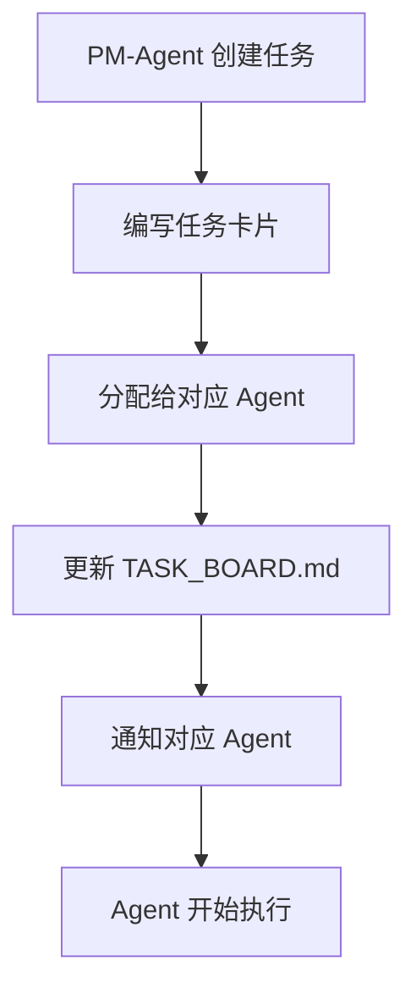
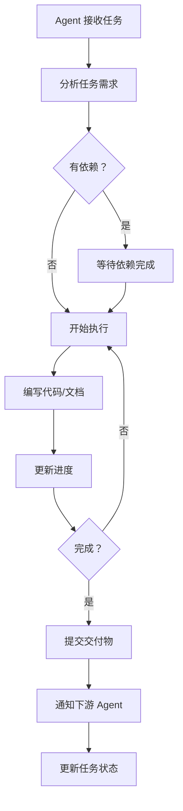
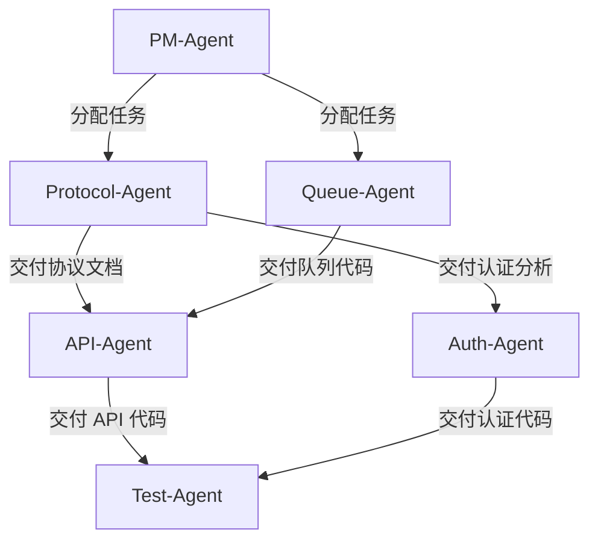
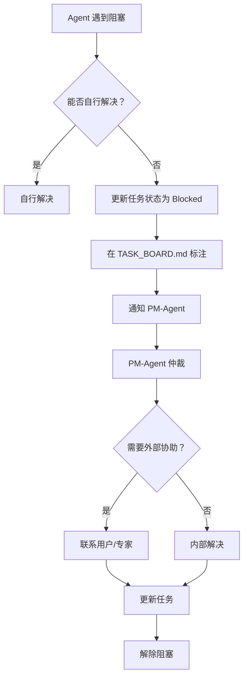

# Agent 协同工作指南

**版本**: 1.0  
**生效日期**: 2026-03-15  
**适用范围**: 所有参与项目的 Agent

---

## ? 目标

建立高效的多 Agent 协同开发流程，确保：
1. 任务清晰分配
2. 进度透明可见
3. 阻塞及时解除
4. 质量持续保障

---

## ? Agent 角色和职责

### PM-Agent (项目协调)
**核心职责**:
- 任务分配和优先级管理
- 进度追踪和风险管理
- 技术决策仲裁
- 对外沟通接口

**工作流**:
```
1. 创建任务卡片 → docs/agents/tasks/TASK-XXX.md
2. 分配给对应 Agent
3. 更新 TASK_BOARD.md
4. 每日站会同步进度
5. 处理阻塞和风险
```

**输出文档**:
- 任务卡片
- 任务看板
- 每日站会报告
- 决策记录

---

### Protocol-Agent (协议逆向)
**核心职责**:
- 网络抓包分析
- 协议格式逆向
- 加密算法破解
- 编写分析文档

**工作流**:
```
1. 接收 PM-Agent 分配的任务
2. 执行抓包和分析
3. 编写分析文档 → docs/agents/protocol-agent/analysis/
4. 更新任务进度
5. 交付协议文档给 API-Agent 和 Auth-Agent
```

**输出文档**:
- 认证流程分析
- API 端点文档
- SSE 协议格式
- 加密算法说明

**依赖关系**:
- 无输入依赖
- 输出依赖：API-Agent, Auth-Agent

---

### API-Agent (API 开发)
**核心职责**:
- OpenAI 兼容 API 实现
- 协议转换器
- 路由和中间件
- API 文档

**工作流**:
```
1. 等待 Protocol-Agent 交付协议文档
2. 设计 API 路由映射
3. 实现 Gin 服务器
4. 实现协议转换器
5. 编写单元测试
6. 交付给 Test-Agent
```

**输出文档**:
- API 路由文档
- 转换器设计
- 中间件说明

**依赖关系**:
- 输入依赖：Protocol-Agent (TASK-001, TASK-002)
- 输出依赖：Test-Agent

---

### Auth-Agent (认证管理)
**核心职责**:
- Token 生命周期管理
- 账号池实现
- 认证中间件
- 安全存储

**工作流**:
```
1. 等待 Protocol-Agent 交付认证分析
2. 设计 Token 管理方案
3. 实现账号池
4. 实现加密存储
5. 编写单元测试
6. 交付给 Test-Agent
```

**输出文档**:
- Token 管理设计
- 账号池方案
- 加密存储说明

**依赖关系**:
- 输入依赖：Protocol-Agent (TASK-001)
- 输出依赖：Test-Agent

---

### Queue-Agent (队列管理)
**核心职责**:
- 请求队列实现
- 调度算法
- 限流降级
- 排队状态推送

**工作流**:
```
1. 接收 PM-Agent 分配的任务
2. 设计队列调度算法
3. 实现限流器
4. 实现降级策略
5. 实现 SSE 状态推送
6. 编写单元测试
```

**输出文档**:
- 队列调度设计
- 限流算法说明
- 降级策略文档

**依赖关系**:
- 输入依赖：PM-Agent (需求定义)
- 输出依赖：API-Agent (集成)

---

### Test-Agent (质量保障)
**核心职责**:
- 单元测试编写
- 集成测试执行
- 性能基准测试
- 兼容性验证

**工作流**:
```
1. 等待 API-Agent 和 Auth-Agent 交付代码
2. 编写单元测试
3. 执行集成测试
4. 性能基准测试
5. 报告测试结果
```

**输出文档**:
- 测试计划
- 测试用例
- 测试报告
- 性能基准

**依赖关系**:
- 输入依赖：API-Agent, Auth-Agent, Queue-Agent
- 输出依赖：PM-Agent (质量报告)

---

### UI-Agent (界面开发)
**核心职责**:
- React 界面实现
- Electron 集成
- 状态管理
- API 对接

**工作流**:
```
1. 接收 PM-Agent 分配的任务
2. 实现 UI 组件
3. 集成后端 API
4. 实现状态管理
5. 编写 UI 测试
```

**输出文档**:
- UI 组件文档
- 状态管理设计
- API 集成说明

**依赖关系**:
- 输入依赖：API-Agent (API 定义)
- 输出依赖：最终用户

---

## ? 协作流程

### 任务创建和分配



### 任务执行



### 依赖管理



---

## ? 文档规范

### 任务卡片格式

```markdown
# TASK-XXX: 任务名称

**分配给**: @Agent-Name  
**优先级**: ? High / ? Medium / ? Low  
**状态**: ? Pending / ? In Progress / ? Completed  
**创建日期**: YYYY-MM-DD  
**截止日期**: YYYY-MM-DD  
**依赖**: TASK-XXX ?

## ? 任务描述
...

## ? 验收标准
- [ ] 标准 1
- [ ] 标准 2

## ? 子任务
- [ ] 子任务 1
- [ ] 子任务 2

## ? 进度更新
### YYYY-MM-DD
- 进度说明
```

### 进度更新规范

**频率**: 每日至少更新一次  
**格式**:
```markdown
### YYYY-MM-DD HH:MM
- ? 完成：xxx
- ? 进行中：xxx (xx%)
- ? 待开始：xxx
- ? 阻塞：xxx (原因)
```

### 交付物规范

**代码交付**:
- 完整的源代码
- 单元测试
- 使用文档
- 依赖说明

**文档交付**:
- 结构清晰
- 包含示例
- 标注待确认事项
- 提供相关链接

---

## ? 阻塞处理

### 阻塞上报流程



### 阻塞状态标注

```markdown
### ? 阻塞
**原因**: 等待 xxx 完成  
**影响**: 无法继续 xxx  
**期望解决时间**: YYYY-MM-DD  
**升级路径**: PM-Agent → 用户
```

---

## ? 进度追踪

### 任务看板更新

**负责人**: PM-Agent  
**频率**: 每日更新  
**内容**:
- 各 Agent 状态
- 任务进度百分比
- 阻塞和风险
- 里程碑完成度

### 每日站会

**时间**: 每日 09:00  
**主持**: PM-Agent  
**议程**:
1. 各 Agent 汇报昨日完成 (2 分钟/Agent)
2. 今日计划 (1 分钟/Agent)
3. 阻塞和风险讨论 (5 分钟)
4. PM-Agent 总结 (2 分钟)

**输出**: 每日站会报告

---

## ? 质量保证

### 代码审查

**审查人**: 相关 Agent + PM-Agent  
**审查点**:
- 代码规范
- 测试覆盖
- 性能影响
- 安全性

### 文档审查

**审查人**: PM-Agent  
**审查点**:
- 完整性
- 准确性
- 清晰度
- 一致性

---

## ? 相关链接

- [任务看板](./TASK_BOARD.md)
- [项目启动](./PROJECT_START.md)
- [团队职责](./TEAM.md)

---

**最后更新**: 2026-03-15 14:30  
**下次审查**: 2026-03-22 (周会)
