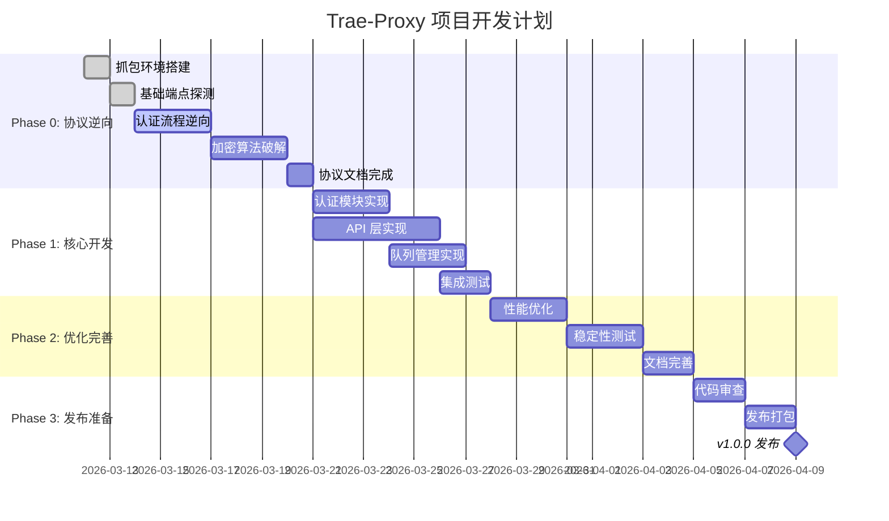

# PM-Agent 工作区

## 角色定位

**Project Manager Agent** - 项目负责人，负责整体规划、任务分配、进度追踪和决策仲裁

---

## 当前阶段

**Phase 0 - 协议逆向工程** (进行中，进度 15%)

### 已完成
- ? Phase 0.1: 探索 Trae CN 安装目录结构
- ? Phase 0.2: 分析 Electron 应用源码（无 asar 打包）
- ? Phase 0.3: 提取 API 端点 URL 和认证机制
- ? PM-0.1: 创建详细的项目路线图
- ? PM-0.2: 定义各 Agent 的职责边界
- ? PM-0.3: 建立任务优先级系统

### 进行中
- ? Phase 0.4: 配置 mitmproxy 抓包环境
- ? Phase 0.5: 抓取完整通信流量（登录/对话/排队）
- ? PM-0.4: 设置进度报告机制
- ? Phase 1: 认证模块 (API-Agent 完成)
- ? Phase 2: 核心聊天 API (API-Agent 完成)

### 待开始
- ? Phase 0.6: 记录协议分析文档
- ? Phase 1: 认证模块
- ? Phase 2: 核心聊天 API
- ? Phase 3: 排队系统
- ? Phase 4: 多账号负载均衡

---

## Agent 团队协作

| Agent | 职责 | 负责人 | 状态 |
|-------|------|--------|------|
| **PM Agent** | 项目管理/协调/决策 | 自动 | ? Active |
| **Protocol Agent** | 协议分析/逆向工程 | 自动 | ? Active |
| **Auth Agent** | 认证/Token 管理 | 自动 | ? Active |
| **API Agent** | API 实现/格式转换 | 自动 | ? Active |
| **Queue Agent** | 排队/调度/限流 | 自动 | ? Active |
| **Test Agent** | 测试/验证/质量保证 | 自动 | ? Active |
| **UI Agent** | 管理面板/UI 设计 | 自动 | ? Pending |

---

## 任务分配详情

### Protocol Agent 任务
- [x] 分析 Trae CN 安装目录结构
- [x] 提取 product.json 中的 API 域名
- [x] 分析 aiserver/server.js (15.8MB)
- [x] 提取所有 API 端点
- [ ] 深度分析 extension.js 中的协议逻辑
- [ ] 识别加密/签名机制
- [ ] 编写协议分析文档

### Auth Agent 任务
- [x] 定位 Token 存储位置 (%APPDATA%\Trae CN\storage.json)
- [x] 分析 Token 结构 (token/refreshToken/expiredAt)
- [x] 实现 TokenProvider 基础功能
- [ ] 实现 Token 自动刷新机制
- [ ] 实现多账号轮询
- [ ] 测试 Token 有效性验证

### API Agent 任务
- [x] 实现 /v1/models 端点
- [x] 实现 /v1/chat/completions 端点基础
- [x] 完善 OpenAI 格式转换
- [x] 实现流式响应 (SSE)
- [x] 实现错误处理和重试
- [x] 实现请求日志记录
- [x] 实现中间件链 (CORS/Auth/Logger)
- [x] 编写 API 文档

### Queue Agent 任务
- [x] 实现基础请求队列
- [x] 实现限流器 (RateLimiter)
- [x] 实现熔断器 (CircuitBreaker)
- [ ] 实现 MLFQ 调度算法
- [ ] 集成排队状态监控
- [ ] 实现 SSE 排队进度推送

### Test Agent 任务
- [x] 创建测试脚本模板
- [ ] 编写 API 端点测试
- [ ] 编写认证流程测试
- [ ] 编写压力测试
- [ ] 自动化测试流水线

### UI Agent 任务
- [ ] 设计管理面板 UI
- [ ] 实现账号管理界面
- [ ] 实现监控仪表板
- [ ] 实现日志查看器

---

## 项目里程碑

### M1: 协议分析完成 (Phase 0) - 目标：2026-03-20
- 完整的 API 端点文档
- 认证机制完全理解
- 至少 10 个完整请求分析

### M2: 基础功能可用 (Phase 1-2) - 目标：2026-03-25
- 可以成功调用聊天 API
- OpenAI 兼容接口可用
- 支持至少 3 个模型

### M3: 生产就绪 (Phase 3-4) - 目标：2026-04-01
- 多账号负载均衡
- 排队系统完善
- 管理面板上线

---

## 通信机制

### 事件总线订阅
```go
events := []string{
    "task.started",
    "task.completed",
    "task.failed",
    "agent.blocked",
    "milestone.reached",
}
```

### 上下文共享
- Global: 项目配置、API 端点、模型列表
- Agent: 各 Agent 的私有状态
- Task: 任务特定的临时数据

---

## 风险管理

| 风险 | 概率 | 影响 | 缓解措施 |
|------|------|------|----------|
| Trae CN 协议变更 | 中 | 高 | 持续监控版本更新 |
| Token 失效机制复杂 | 中 | 中 | 实现多种刷新策略 |
| 排队时间过长 | 高 | 中 | 多账号负载均衡 |
| 法律合规风险 | 低 | 高 | 仅限个人学习使用 |

---

## 决策日志

### 2026-03-15: 项目启动
- **决策**: 采用多 Agent 协作架构
- **原因**: 任务复杂，需要模块化分工
- **影响**: 7 个 Agent 各司其职，通过 Event Bus 通信

### 2026-03-15: 技术栈选择
- **决策**: 使用 Go 1.22+ 作为主要开发语言
- **原因**: 性能优秀，并发友好，适合代理服务器
- **影响**: 所有核心模块使用 Go 实现

---

**最后更新**: 2026-03-15  
**下次同步**: 2026-03-16  
**状态**: ? On Track

**Phase 0**: 协议逆向工程 (2026-03-12 ~ 2026-03-20)

**目标**: 完全逆向 Trae CN 协议，为开发提供完整规格说明

---

## 项目里程碑



---

## 任务分配板

### ? 高优先级

#### TASK-001: 完成认证流程逆向
- **分配给**: @Protocol-Agent
- **截止日期**: 2026-03-16
- **状态**: ? In Progress
- **依赖**: 无
- **描述**: 完整分析 Trae CN 的认证机制，包括 Token 生成、刷新、验证流程
- **验收标准**:
  - [ ] 提取 Token 生成算法
  - [ ] 分析刷新机制
  - [ ] 识别所有认证相关请求头
  - [ ] 提供可复现的认证脚本

#### TASK-002: 分析 SSE 流式响应格式
- **分配给**: @Protocol-Agent
- **截止日期**: 2026-03-17
- **状态**: ? Pending
- **依赖**: TASK-001
- **描述**: 破解 SSE 流式响应的数据格式和解析逻辑
- **验收标准**:
  - [ ] 提取 SSE 事件格式
  - [ ] 分析流式数据分块规则
  - [ ] 识别完成标记和错误处理

---

### ? 中优先级

#### TASK-003: 设计账号池管理方案
- **分配给**: @Auth-Agent
- **截止日期**: 2026-03-18
- **状态**: ? Pending
- **依赖**: TASK-001
- **描述**: 设计多账号管理和轮换机制
- **验收标准**:
  - [ ] 账号存储方案
  - [ ] 轮换策略设计
  - [ ] 健康检查机制
  - [ ] 防封号策略

#### TASK-004: 设计 API 路由映射
- **分配给**: @API-Agent
- **截止日期**: 2026-03-19
- **状态**: ? Pending
- **依赖**: TASK-001
- **描述**: 设计 OpenAI API 到 Trae CN 协议的路由映射
- **验收标准**:
  - [ ] 端点映射表
  - [ ] 参数转换规则
  - [ ] 错误码映射
  - [ ] 响应格式转换

---

### ? 低优先级

#### TASK-005: 调研现有反代项目
- **分配给**: @PM-Agent
- **截止日期**: 2026-03-18
- **状态**: ? Done
- **描述**: 调研 Cursor、Kiro 等项目的反代实现
- **输出**: `docs/knowledge-base/market-research.md`

---

## 资源分配

| Agent | 当前任务 | 负载 | 状态 |
|-------|---------|------|------|
| Protocol-Agent | TASK-001 | 80% | ? Busy |
| API-Agent | - | 0% | ? Available |
| Auth-Agent | - | 0% | ? Available |
| Queue-Agent | - | 0% | ? Available |
| Test-Agent | - | 0% | ? Available |

---

## 风险登记

| 风险 | 影响 | 概率 | 缓解措施 |
|------|------|------|----------|
| 加密算法过于复杂 | 高 | 中 | 预留更多时间，考虑社区协作 |
| 账号资源不足 | 中 | 高 | 提前准备多个测试账号 |
| 协议频繁变更 | 高 | 低 | 设计可更新的协议层 |
| 字节跳动法务风险 | 高 | 低 | 仅限学习研究，不开源 |

---

## 决策日志

### 2026-03-15

**DEC-001**: 选择 Go 1.22+ 作为实现语言
- **理由**: 并发性能优秀、部署简单、HTTP 库成熟
- **提出者**: PM-Agent
- **状态**: ? Approved

**DEC-002**: 采用 OpenAI 兼容 API 格式
- **理由**: 生态成熟，客户端支持广泛
- **提出者**: PM-Agent
- **状态**: ? Approved

**DEC-003**: 支持 14 个 Trae CN 模型
- **理由**: 覆盖全部可用模型，提升竞争力
- **提出者**: PM-Agent
- **状态**: ? Approved

---

## 会议纪要

### 2026-03-15 项目启动会

**参会者**: PM-Agent, Protocol-Agent, API-Agent, Auth-Agent, Queue-Agent, Test-Agent

**议程**:
1. 项目背景和目标介绍
2. 技术架构讨论
3. 任务分工确认
4. 时间表确认

**决议**:
- 确认 Phase 0 于 2026-03-20 完成
- Protocol-Agent 优先完成认证流程逆向
- 其他 Agent 待命，准备接收任务

**行动项**:
- [ ] Protocol-Agent: 开始 TASK-001
- [ ] PM-Agent: 创建任务卡片
- [ ] All: 熟悉项目文档

---

## 进度报告

### Week 1 (2026-03-12 ~ 2026-03-15)

**整体进度**: 20%

**完成**:
- ? 项目立项
- ? 架构设计
- ? 抓包环境搭建
- ? 基础端点探测

**进行中**:
- ? 认证流程逆向 (预计 2026-03-16 完成)

**延期**: 无

**风险**: 无重大风险

---

## 待办事项

### 本周 (2026-03-15 ~ 2026-03-21)

- [ ] 完成认证流程逆向 (TASK-001)
- [ ] 开始 SSE 格式分析 (TASK-002)
- [ ] 启动账号池设计 (TASK-003)
- [ ] 启动 API 路由设计 (TASK-004)

### 下周 (2026-03-22 ~ 2026-03-28)

- [ ] 完成协议文档
- [ ] 开始核心模块开发
- [ ] 建立测试框架

---

## 沟通记录

### 2026-03-15 10:30

**Protocol-Agent → PM-Agent**: 
> 请求协调获取 3 个测试账号用于逆向分析

**PM-Agent → Protocol-Agent**: 
> ? 已批准，请联系 @Auth-Agent 准备账号资源

### 2026-03-15 14:00

**PM-Agent → All**: 
> Phase 0 里程碑已更新，请各 Agent 查阅 `docs/agents/pm-agent/milestones.md`

---

## 质量管理

### 代码审查安排

| 提交者 | 审查者 | 时间 |
|--------|--------|------|
| Protocol-Agent | API-Agent | 每周五 15:00 |
| API-Agent | Auth-Agent | 每周五 16:00 |
| Auth-Agent | Queue-Agent | 每周五 17:00 |

### 文档审查

所有协议文档必须经过 PM-Agent 审查后才能发布到知识库

---

## 联系信息

- **工作目录**: `docs/agents/pm-agent/`
- **日志文件**: `docs/agents/pm-agent/daily-log.md`
- **事件记录**: `docs/agents/event-log.md`
- **决策记录**: `docs/decisions/`

---

**最后更新**: 2026-03-15 18:00  
**下次更新**: 2026-03-16 09:00
